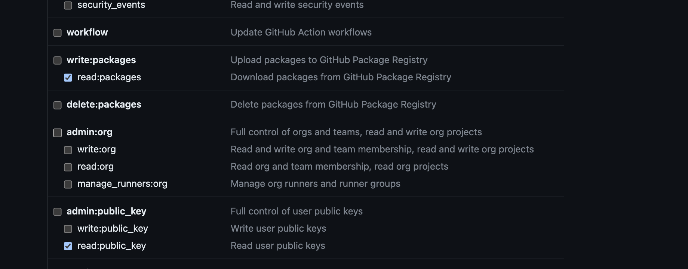

Steth-IO-SDK
=======

## Example
	Clone this repositary to install the example.

## Requirements
- The recording frequency must be 44.1khz because the filters are designed in such way.
- The heart/lung filters will work as expected only with Steth IO hardware.
- Any headset can be used to connect and take an exam

## Installation

##### 1. Need to create access token 
https://github.com/settings/tokens

Following permission required `Generate new (classic) token`

1. `read:packages`
2. `read:public_key`




##### 2. Add build.gradle


```
allprojects {
    repositories {
        maven {
            url = uri("https://maven.pkg.github.com/StratoScientific/StethIO-SDK-Android")
              credentials {
                    username = "USER_NAME"
                    password = "PERSONAL_ACCESS_TOKEN"
                }
         }
      }
}
```

##### 3. Include the library in **build.grade** (Module)

```
dependencies {
    implementation 'com.stratoscientific:stethio:1.0.$VERSION'
}
```

### Using SDK

1. Initialize setup
```
    StethIOBase.prepare(this);
    StethIOBase.getInstance().setDebug(true);
    StethIOBase.getInstance().setAPiKey("<KEY>");
    StethIOBase.getInstance().setListener(new StethIOBase.Listener() {
            @Override
            public void onReadyToStart() {

            }
        });
            
```
2. Listener of recording callback
```
StethIOManager stethIO = StethIOManager.getInstance();
stethIO.setListener(new StethIOManagerListener() {

      @Override
      public void onStarted() {
          Log.d(TAG,"onStarted");
      }

      @Override
      public void onCancelled() {
          Log.d(TAG, "onCancelled");
      }

      @Override
      public void onReceivedDuration(long milliseconds) {
          Log.d(TAG, "onReceivedDuration" + milliseconds/1000);
      }

      @Override
      public void onRenderSpectrumGLSurfaceView(long id, ExamType examType) {
          spectrumGLSurfaceView.setMap(id, examType);
      }
      @Override
      public void onFinished(File file) {
          Log.d(TAG, "onFinished" + file);
       }
});

 stethIO.setBpmListener(value -> runOnUiThread(() -> {
     Log.d("BPM changed", String.valueOf(value));
}));
```
3. SpectrumGLSurfaceView layout design render
```
<com.stratoscientific.stethio.SpectrumGLSurfaceView
        android:id="@+id/glSurfaceView"
        android:layout_width="match_parent"
        android:layout_height="400dp"/>
```
4. Actions

###### StethIOBase 

     it used for setup

|Param |   Type    | Required   | Description  | Exception
|:--- | --- | :---:| :--- | :---:|
|setAPiKey| Function|✅|requied valid api key| `InvalidAPIKeyException`
|setEnvironment| Function | | default `PRODUCTION`, change the environment `STAGING` or `PRODUCTION`|
|setDebug| Function ||default value is `false`|

######  StethIOManager

     it used for start & manage the exam.

|Param |   Type    | Required   | Description  | Exception
|:--- | --- | :---:| :--- | :---:|
|isPause| Function | | recording of pause status `Boolean`|
|isRecording| Function | | recording is active or not `Boolean`|
|isHeadphonesPlugged| Function | | Headphones is Connected or not  `Boolean`|
|isBluetoothPlugged| Function | | isBluetoothDevice Plugged  or not `Boolean`|
|setSampleType| Function |✅|SampleType `NONE`, `RAW_AUDIO`, `PROCESSED_AUDIO`|
|start| Function |✅|start the exam, when API key are valid and audio permission ExamType  `HEART`,`LUNG`, `VASCULAR` |`InvalidAPIKeyException`, `AudioPermissionException`
|pause| Function | | pause  recording, if recording is running|
|resume| Function | | resume  recording, if recording is pause|
|cancel| Function | | cancel  recording, if recording is running|
|finish| Function | | finish  recording, if recording is running|

## Important ⚠️
 * The API_KEY in the example application will only work for the example application. Using the same key in another application will not work.
 * stop or cancel exam is mandatory.  if exam is not completed, you can't take other exam

## Author
StethIO, craig@stethio.com

## License
Steth-IO-Android is available under the MIT license. See the LICENSE file for more info.
